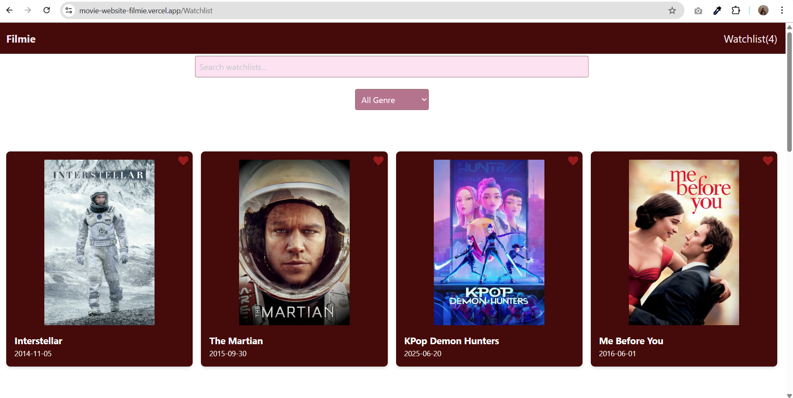

# Movie Website

A modern and responsive movie web app built using **React**, **Vite**, and **Tailwind CSS**. This app displays a list of selected movies, allows filtering by genre, and lets users add movies to a watchlist.

## Features

- Movie listing with title, poster, and release date
- Genre filter dropdown
- Watchlist add/remove functionality
- Fully responsive design (desktop, tablet, mobile)
- Reusable React components
- Styled using Tailwind CSS

## Technologies Used

- React
- Vite
- Tailwind CSS
- JavaScript 

movie-website/
├── public/
├── src/
│   ├── assets/
│   ├── components/
│   ├── context/
│   ├── pages/
│   ├── screenshots/
│   ├── App.jsx
│   ├── index.css
│   └── main.jsx
├── package.json
├── tailwind.config.js
├── postcss.config.js
└── vite.config.js

## Screenshots

### Homepage - Desktop View
.png)

### Homepage - Mobile View

### Homepage - Tablet Search View
.png)

### Genre Filter Dropdown

### Watchlist Page

### Watchlist Search

## Live Demo

[https://movie-website-filmie.vercel.app](https://movie-website-filmie.vercel.app)

## Feedback

Thank you for checking out this project.  
Feel free to open issues or give suggestions for improvement.

Made with using React, Tailwind CSS, Vite, and TMDB API.

 Autho[Manjushree](https://github.com/Manjushree8)
